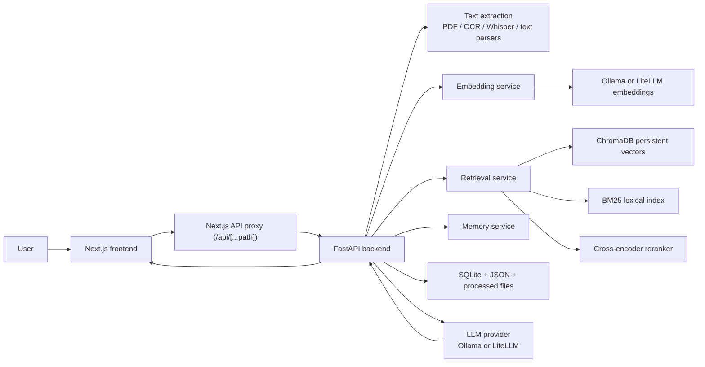

# STARK

> Local-first RAG workspace for chatting with documents, extracting decisions, and drafting grounded answers on your own machine.

`STARK` is a full-stack local knowledge assistant built around FastAPI, Next.js, ChromaDB, SQLite, and LiteLLM/Ollama. You upload files, the backend extracts and enriches their text, chunks and embeds the content, stores vectors locally, and then serves streamed chat answers grounded in retrieved context. The app is aimed at teams or individual operators who want a private, self-hosted document assistant instead of sending their data to a hosted SaaS.

## What It Does

In plain English:

- You upload files such as PDFs, markdown notes, screenshots, audio recordings, email exports, or Slack exports.
- The backend converts each file into text using the appropriate extractor.
- That text is summarized, chunked, embedded, and indexed locally.
- In chat, the app retrieves relevant chunks and streams an answer backed by those sources.
- It also supports comparison-style retrieval, persistent cross-session memory, workspaces, structured response modes, and scoped/mentioned document queries.

## Tech Stack


### Frontend

- Next.js `^15.0.0`
- React `^19.0.0`
- TypeScript `^5.7.2`
- Tailwind CSS `^3.4.17`
- Framer Motion `^12.9.4`
- Lucide React `^0.511.0`
- React Markdown `^10.1.0`

### Backend

- FastAPI `>=0.115,<1.0`
- Uvicorn `>=0.30,<1.0`
- Pydantic `>=2.8,<3.0`
- ChromaDB `>=0.5,<1.0`
- LiteLLM `>=1.51,<2.0`
- aiosqlite `>=0.20,<1.0`
- pypdf `>=5.0,<6.0`
- pytesseract `>=0.3,<1.0`
- Pillow `>=10.4,<11.0`
- faster-whisper `>=1.0,<2.0`
- sentence-transformers `>=3.0,<4.0`
- rank-bm25 `>=0.2,<1.0`

## Architecture



### Storage layout

- `backend/data/uploads/`: raw uploaded files
- `backend/data/processed/`: extracted text and enrichment JSON
- `backend/data/chroma/`: persistent ChromaDB vector store
- `backend/data/conversations.db`: workspaces, conversations, messages, memories
- `backend/data/chunks.db`: parent chunk storage for context expansion
- `backend/data/graph.db`: document relationship edges
- `backend/data/workspaces/<workspace_id>/settings.json`: workspace settings
- `backend/data/workspaces/<workspace_id>/documents.json`: workspace document metadata

## How the RAG Pipeline Actually Works

### 1. Ingestion

The upload endpoint is `POST /upload`. `IngestionPipeline.ingest_uploads()` saves each file under a checksum-based filename, creates a placeholder document record with `processing` status, and starts async indexing work.

Special ingestion behavior:

- `.eml`: parsed into text via `email_parser.py`
- `.zip`: treated as Slack export archives and expanded via `slack_parser.py`
- other supported files: extracted directly

### 2. Text extraction

`TextExtractionService` chooses extraction by extension:

- PDF: `pypdf.PdfReader`
- Markdown / text / parsed email text: UTF-8 file read
- Images: Tesseract OCR via `pytesseract`
- Audio: Faster Whisper transcription via `faster-whisper`

Current supported extensions from `backend/app/core/constants.py`:

- PDFs: `.pdf`
- Text: `.md`, `.txt`, `.eml`
- Images: `.png`, `.jpg`, `.jpeg`, `.tiff`, `.bmp`, `.webp`
- Audio: `.mp3`, `.wav`, `.m4a`, `.flac`, `.ogg`
- Archives: `.zip` (Slack export import path)

### 3. Enrichment

Before embedding, `EnrichmentService` generates document-level metadata such as:

- summary
- document type
- topics

It also contextualizes individual chunks by prepending a generated header, plus the filename, to improve downstream retrieval.

### 4. Chunking

`split_text_parent_child()` creates parent-child chunk groups:

- parent chunks are larger context containers
- child chunks are the embedded retrieval units
- page and offset metadata are preserved where possible

Parent chunks are also stored in `chunks.db` so retrieved children can later be expanded back into richer context.

### 5. Embeddings and indexing

`EmbeddingService` batches embedding calls. By default the configured models are:

- chat model: `llama3.1:8b`
- enrichment model: `llama3.2:3b`
- embedding model: `nomic-embed-text`
- Whisper model: `base`

The default local provider path is Ollama, with `OLLAMA_KEEP_ALIVE=5m`.

Embeddings are stored in ChromaDB through `ChromaVectorStore.upsert_document()`, alongside metadata such as filename, file type, topics, source type, page number, and parent chunk ID. A BM25 index is also maintained in parallel.

### 6. Retrieval

`RetrievalService.retrieve()` uses a multi-step pipeline:

1. Embed the user query
2. Build retrieval filters from chat scoping, tags, file type, and temporal hints
3. Run semantic search in ChromaDB
4. Run lexical search in BM25
5. Fuse results using reciprocal rank fusion
6. Re-rank with the cross-encoder when enabled
7. Apply final reranking and minimum chunk coverage
8. Expand with related documents
9. Swap child chunks for stored parent chunks when available

This is not a plain top-k vector lookup. It is a hybrid retrieval pipeline with reranking and parent-context expansion.

### 7. Chat generation

`ChatService.stream_response()` classifies the question, selects a response mode, retrieves sources, optionally injects persistent memory, and streams tokens back over Server-Sent Events.

Extra response paths implemented in code:

- comparison retrieval across documents
- contradiction analysis
- action-item-focused retrieval
- draft mode prompt shaping
- mention-aware source inclusion (`@document`)
- tag-aware topic focus (`#tag`)
- workspace-aware conversation persistence

## Features Present in the Codebase

### Core

- Local file upload and indexing
- Streamed chat answers over SSE
- Persistent ChromaDB vector storage
- SQLite-backed conversations and message history
- Workspace support
- Re-indexing when embedding settings change
- Storage usage and disk usage reporting

### AI / Retrieval

- Ollama-first local inference
- LiteLLM provider abstraction for non-Ollama chat and embeddings
- Hybrid retrieval: semantic + BM25
- Cross-encoder reranking
- Comparison-mode retrieval across many documents
- Contradiction analysis mode
- Response modes: `answer`, `summary`, `extract`, `action_items`, `timeline`, `draft`, `gaps`
- Temporal query hints (`recent`, `last week`, `last month`, `quarter`, etc.)
- Related-document expansion

### Ingestion / Knowledge Processing

- PDF extraction
- OCR for images
- Audio transcription with Faster Whisper
- Email import from `.eml`
- Slack export import from `.zip`
- Per-document summaries, topics, and type enrichment
- Tagging and document relationships

### Memory

- Persistent memory facts across sessions
- Conversation summaries
- User preference memory
- Memory listing and deactivation APIs

### Frontend

- Next.js App Router frontend
- Chat UI with conversation history
- Rich composer with command palette and `@` / `#` mention chips
- Document library and upload flow
- Settings and onboarding screens
- Source pages for external connector scaffolds

## API Surface

### Health

| Method | Path | Purpose |
|---|---|---|
| `GET` | `/health` | Liveness check |

### Workspaces

| Method | Path | Purpose |
|---|---|---|
| `GET` | `/workspaces` | List workspaces |
| `POST` | `/workspaces` | Create workspace |
| `POST` | `/workspaces/{workspace_id}/select` | Set active workspace |

### Documents and ingestion

| Method | Path | Purpose |
|---|---|---|
| `POST` | `/upload` | Upload and start indexing files |
| `GET` | `/documents` | List documents |
| `GET` | `/documents/{document_id}` | Fetch document detail and extracted text |
| `GET` | `/documents/{document_id}/file` | Download original file |
| `PATCH` | `/documents/{document_id}/status` | Update document status |
| `DELETE` | `/documents/{document_id}` | Delete document and vectors |
| `POST` | `/reindex` | Re-index all documents |
| `GET` | `/documents/tags` | List all tags |
| `PATCH` | `/documents/{document_id}/tags` | Update tags |

### Document graph

| Method | Path | Purpose |
|---|---|---|
| `POST` | `/documents/{document_id}/relationships` | Add document relationship |
| `GET` | `/documents/{document_id}/relationships` | List relationships |
| `DELETE` | `/documents/relationships/{edge_id}` | Delete relationship |

### Chat and conversations

| Method | Path | Purpose |
|---|---|---|
| `POST` | `/chat` | Stream chat answer |
| `GET` | `/conversations` | List conversations |
| `POST` | `/conversations` | Create conversation |
| `GET` | `/conversations/{conversation_id}` | Get conversation summary |
| `GET` | `/conversations/{conversation_id}/messages` | Get message history |
| `POST` | `/conversations/{conversation_id}/messages` | Append message manually |
| `PATCH` | `/conversations/{conversation_id}` | Rename conversation |
| `POST` | `/conversations/{conversation_id}/pin` | Toggle pin |
| `DELETE` | `/conversations/{conversation_id}` | Delete conversation |
| `GET` | `/conversations/{conversation_id}/search` | Search within conversation |
| `POST` | `/messages/{message_id}/rate` | Rate assistant message |

### Settings and status

| Method | Path | Purpose |
|---|---|---|
| `GET` | `/settings` | Read persisted settings |
| `POST` | `/settings` | Update settings |
| `GET` | `/ollama/status` | Check Ollama connectivity |
| `GET` | `/storage/usage` | Report app storage usage |
| `GET` | `/storage/disk` | Report disk usage |

### Memory

| Method | Path | Purpose |
|---|---|---|
| `GET` | `/memories` | List memory facts |
| `DELETE` | `/memories/{memory_id}` | Deactivate memory fact |
| `GET` | `/memory/summaries` | List conversation summaries |
| `GET` | `/memory/preferences` | List stored preferences |

### Source connectors

| Method | Path | Purpose |
|---|---|---|
| `GET` | `/sources` | List source connectors |
| `POST` | `/sources/{source_type}/connect` | Start connector auth flow |
| `GET` | `/sources/{source_type}/callback` | OAuth callback scaffold |
| `POST` | `/sources/{source_type}/sync` | Trigger sync scaffold |
| `GET` | `/sources/{source_type}/status` | Connector status scaffold |
| `DELETE` | `/sources/{source_type}/disconnect` | Disconnect scaffold |
| `GET` | `/sources/{source_type}/items` | List indexed items scaffold |

`/sources` is currently scaffold-level. The routes return mock/manual connector data rather than full live integrations.

## Frontend / Backend Interaction

The frontend does not call the backend directly from the browser in every case. `frontend/app/api/[...path]/route.ts` proxies requests to the backend service, including SSE chat responses. In Docker, the proxy target defaults to `http://backend:8000`.

## Getting Started

### Prerequisites

- Python 3.11
- Node.js 20+
- `pnpm`
- Ollama installed and running
- System packages for local backend runs:
  - `ffmpeg`
  - `tesseract-ocr`
  - image runtime libs required by Pillow

### Option A: Run with Docker Compose

```bash
cd docker
docker compose up --build
```

Services started by `docker/docker-compose.yml`:

- backend on `http://localhost:8000`
- frontend on `http://localhost:3000`
- Compose project name is fixed to `stark`, so container and network names stay stable across machines

### Option B: Run locally without Docker

Backend:

```bash
cd backend
python3 -m venv .venv
source .venv/bin/activate
pip install -r requirements.txt
uvicorn app.main:app --host 0.0.0.0 --port 8000 --reload
```

Frontend:

```bash
cd frontend
pnpm install
pnpm dev --hostname 0.0.0.0 --port 3000
```

### Ollama models

Pull the default local models used by the code:

```bash
ollama pull llama3.1:8b
ollama pull llama3.2:3b
ollama pull nomic-embed-text
```

If you plan to transcribe audio locally, the backend will use Faster Whisper with `DEFAULT_WHISPER_MODEL=base` unless you change it.

## Environment Variables

These are defined in `.env.example` or inferred directly from `EnvironmentSettings`:

| Variable | Default | Purpose |
|---|---|---|
| `APP_ENV` | `development` | Runtime mode |
| `BACKEND_HOST` | `0.0.0.0` | Backend bind host |
| `BACKEND_PORT` | `8000` | Backend port |
| `CORS_ORIGINS` | empty in `.env.example`, code default `http://localhost:3000` | Allowed frontend origins |
| `NEXT_PUBLIC_API_URL` | empty | Frontend API base override |
| `OLLAMA_BASE_URL` | empty in `.env.example`, code default `http://host.docker.internal:11434` | Ollama server URL |
| `OLLAMA_KEEP_ALIVE` | `5m` | Keep Ollama models loaded for 5 minutes |
| `OLLAMA_LLM` | `llama3.1:8b` | Intended default chat model |
| `OLLAMA_EMBED` | `nomic-embed-text` | Intended default embedding model |
| `DEFAULT_WHISPER_MODEL` | `base` | Faster Whisper model |
| `DATA_PATH` | `/data` in `.env.example` | Data root hint |

Notes:

- The runtime settings UI can override several model choices and providers after startup.
- The Python config class uses `data_root`, while `.env.example` exposes `DATA_PATH`; this deserves cleanup if you want one canonical variable.

## Technical Highlights

- Hybrid retrieval instead of plain vector search: semantic Chroma retrieval, BM25 lexical retrieval, reciprocal rank fusion, then cross-encoder reranking.
- Parent-child chunking with later parent expansion to improve answer context density.
- Comparison-mode retrieval that deliberately represents many documents instead of letting top-k similarity cluster around only one or two.
- Persistent memory stored alongside conversation history, with fact extraction and conversation summarization running as best-effort background tasks.
- Local-first model strategy with Ollama, but provider abstraction through LiteLLM for OpenAI/Anthropic-compatible paths.
- Workspace-aware persistence without requiring a separate external database server.

## Known Gaps / TODOs

- The `/sources` integrations are scaffolds, not complete connector implementations.
- The repo contains onboarding and UI system work in progress; the frontend is feature-rich but still evolving structurally.
- There is no documented authentication layer in the current backend routes.
- Production deployment guidance is still a TODO beyond the local Docker/dev setup.
- The env/config naming around `DATA_PATH` vs `data_root` should be normalized.

## Repository Structure

```text
backend/
  app/
    api/              FastAPI routes
    core/             config and constants
    providers/        LLM and embedding provider adapters
    schemas/          Pydantic request/response models
    services/         ingestion, retrieval, chat, memory, storage, graph
frontend/
  app/                Next.js App Router pages and API proxy
  components/         chat, documents, onboarding, shared UI
  lib/                API client, shared types, frontend helpers
docker/
  docker-compose.yml  local multi-service dev stack
docs/
  project notes and architectural walkthroughs
```

## Contact

- Website: `TODO`
- Documentation hub: `TODO`
- Issue tracker: `TODO`
- Maintainer: `TODO`
